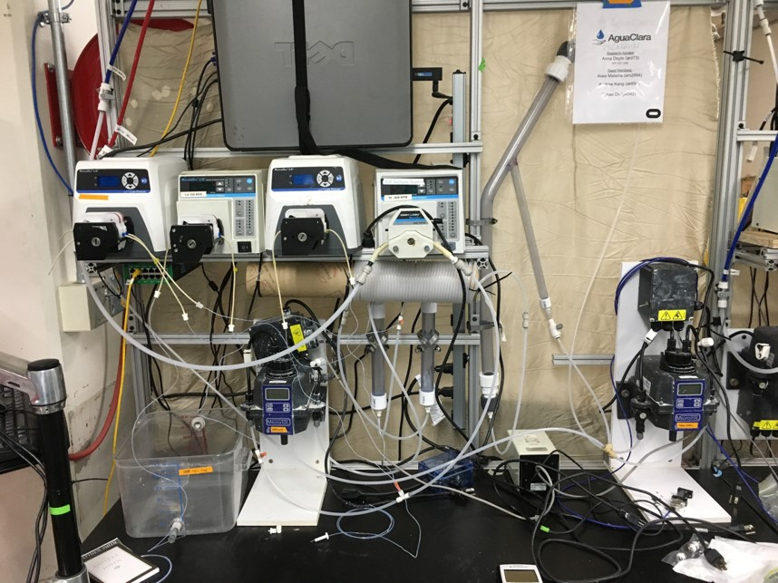

# 2 stage coagulant addition, Spring 2018
#### Barbara Oramah， Ching Pang， Yuhao Du
#### March 1, 2018

## Abstract
**Previous work:** Last semester, our group designed and fabricated the experiment apparatus and conducted experiment for both 1 stage and 2 stages coagulant addition. Our data is not enough to come up with a grand conclusion, but the data we generated suggest that there might be trade-off when we switch from 1 stage to 2 stages. Besides, we also made some simplification to our system.


**Goals & Objectives:** This semester, our group focused on comparing 1 stage addition with 2 stage addition and carrying on the experiment with different influent turbidities, coagulant dosage and humic acid concentration as well as trying to improve Yingda's coagulant dosage model. Besides, more insight on the particles bond mechanism, flocculation, and geometry of the contact chambers were needed. Eventually, we will try to close the debate of 1 stage vs 2 stage, come up with a conclusion and generate enough data to support it.


**What we have accomplished:** Up to now we have completed the literature review, and working on apparatus set up.The research was  based on Yingda's thesis, who studied the effect of humic acid on the coagulant dosing model. Based on the bonding mechanism, it could be hypothesized that two-stage coagulant addition would increase the removal efficiency of particles while maintaining the coagulant dosage.


**Future work:** We have encountered several problems: the high pressure within the system, the leak caused by the poor connection. In next few weeks, we would fix those problems and begin to conduct our experiment. After discussed with Monroe, we suspected that the size of our first contact chamber is not enough for the HA and coag nanoparticles in the synthetic water to generate enough successful collision, so recalculation and test on the CC are also required.


## Introduction

We have to understand the physical and chemical process in flocculation before we can optimize our water treatment process, thus a predictive model which can describe the flocculation process is needed. However, in the past research of AguaClara project team, the model we built only consider the clay and coagulant in the system, it is kind of useless in engineering applications because NOM can be found in nearly every surface water resources and some of the groundwater resources and the presence of NOM can create a need for increased coagulant doses in drinking water treatment.

So we have to extend the model base on our past research, take the effect of NOM on flocculation into consideration. After study the bond mechanism between clay, humic acid, and coagulant, we came up with an assumption that we could add the coagulant separately to save coagulant, because it was assumed that after stage 1, all coagulant would be coated by humic acid, thus the coagulant adds in stage 2 could merely function as an agglomerant then achieved better performance in flocculation process and the aggregation process. After we have the model, we can try to optimize our water treatment process, for example, use the coagulant more efficiently and cut down the operational cost. AguaClara is an engineering project team, so cost is always our concern.


## Literature Review and Previous Work

The fundamental objective of the two stage coagulant addition subteam is to research and find out if there are beneficial effects of two stage addition of PaCl. This would theoretically allow us to use our coagulant more efficiently which would consequently also reduce cost. Besides lab research, this requires research from external parties and other AguaClara teams. We investigated the effects of humic Acid in water and how it coagulates, as well as revisiting Yingda Du’s thesis on the effects of humic acid on flocculation. With this background knowledge, this would aid our advancement in our research.

Humic acid is considered natural organic matter, and it is of the final components made after the breakdown of plant and animal decay. It is commonly found in the soil as it promotes a fertility, it is also used as fertilizers. There is an increase in humic acid concentrations in the wet seasons. The most visual issue of humic acid is that it cause water to change colour. However, in the process of creating potable water, the addition of other compounds and elements with humic acid assists the formation of harmful byproducts such as trihalomethane and haloacetic acid.

### Observations and a Geometric Explanation of the Effects of Humic Acid on Flocculation
  The general science behind flocculation can be understood by analysing the thesis of the observations and a geometric explanation of the effects of HA flocculation by Yingda Du. The thesis gives a clear layout of why we are using HA as the natural organic matter as well as the chemistry behind the creation of flocs. We are using HA as the exemplary compound to represent dissolved NOM because it is the most commonly found form of NOM in our surroundings.  Clay is used to represent the colloidal solids. As NOM is easily found in our soil and water, it increases our need of coagulant to promote flocculation of dissolved particles in water.  Hence why in our model of the experiment we add humic acid and clay with the coagulant PaCl (polyaluminium chloride). However, there is a cut-off point as to how much coagulant we can add to the raw water for it to be beneficial in the removal of NOM. This observation shows that some NOM become increasingly uncooperative to being removed due to the increased presence of coagulant. Our understanding behind the lack of floc formation of NOM in the presence of increased coagulant addition is limited, yet it is an area of interest in determining the magnitude of the effect.
Nevertheless, Yingda’s report focuses on the effect on coagulation of humic acid in the form of hydraulic flocculation, with the consideration of the following processes of filtration and sedimentation. Her research is crucial to our subteam as it provides us with a basis of how we should set up our own apparatus, as well as the physics behind the creation of flocs.

### Using PACl as neutralizer and coagulant aid
Coagulation is one of the most effective methods to remove fine substances from particles. Polyaluminum Chloride (PAC) is often associated with this process to reduce DBPs precursors. PAC prepolymerized coagulants are highly preferred commercially because of its wide range of targets, such as low dosage, wide pH range, low sensitivity of temperature and low residual meal-ion concentration. The effect of PAC with Calcium Carbonate in removing Humic Acid was significantly efficient comparing to other chemicals, because such combination acts as both alkaline chemical and coagulant agent. Comparing with other coagulant types such as Ferric Acid and Aluminum Sulfate, PAC has a significantly high removal efficiency even at a low dosage. In addition, the removal rate of PAC is higher than that of NaOH as alkaline agent. CaCO3 as coagulant reagent, has a significantly high sedimentation velocity, and the sludge volume is reduced by half comparing to that of NaOH. CaCO3 has the highest rate of removing HA and DOC, as its flock core promoted flock formation. This allowed a shorter settling time for the removal for DOC. In addition, the electrical double layer (EDL) of both PAC surface and HA colloid particles is compressed by Ca2+ ions.

### Effectiveness of Two-Stage Coagulant Addition


## Methods
Explain the techniques you have used to acquire additional data and insights. Reserve fine detail for the Manual at the end of the report, but use this section to give an overview with enough detail for the reader to understand your Results and Analysis. Describe your apparatus, and have a justification for every decision you made and every parameter you chose in the design of the apparatus. Be especially careful to detail the conditions your experiments were conducted under, as this information is especially important for interpreting your results

Below, some example sections are given. Sectioning the report is meant to keep similar information together.  Continue making sections as necessary, or delete sections if you do not need them. Feel free to add subsubsections to further delineate the information. For example, under the Experimental Apparatus section below, the EStaRS team might consider having sections such as "Filter Design" and "Filter Fabrication".

Reported Cornell University tap water characteristics were as follows: total hardness $\approx$ 150 mg/L as CaCO3; total alkalinity $\approx$ 108 mg/L as CaCO3; pH $\approx$ 7.44; turbidity $\approx$ 0.06 NTU; and concentration of DOC $\approx$ 1.95 mg/L (Bolton Point Water System 2015). A concentrated stock of HA was added into the raw water to get concentrations ranging from 0mg/L to 15 mg/L. PACl coagulant doses ranged from 0.53 mg/L as Al to 2.65 mg/L as Al used to treat the synthetic water. The coagulant and HA dosage was controlled by the rotation speed of separate peristaltic pumps. Influent turbidities of 50 and 100 NTU were tested. Flocculation was accomplished through a coiled 9.52 mm (inner diameter) tube. The overall experimental flow rate was 6 mL/s and the radius of curvature (Rc) was 15 cm.


### Experimental Apparatus
Explain your apparatus setup using enough detail such that future teams can recreate your apparatus. Make sure to explain why you built it this way.
* Design (calculations, constraints)

  $\frac{-b\pm\sqrt{b^2-4ac}}{2a}$
* Schematic (label parts)

  

* Image (from lab; label parts)


  
* Materials (dimensions, materials):

* Complications in construction:


* Summary of construction:
 constraints, include any revisions to apparatus, also reference the prior report where construction is described
 The

### Procedure
Discuss your experimental procedure. How did you run your experiment? What were you testing? What were the values of relevant parameters?

## Results and Analysis
Present an observation (results), then explain what happened (analysis).  Each paragraph should focus on one aspect of your results. In that same paragraph, you should interpret that result.  
In other words, there should not be two distinct paragraphs, but instead one paragraph containing one result and the interpretation and analysis of this result. Here are some guiding questions for results and analysis:

When describing your results, present your data, using the guidelines below:
* What happened? What did you find?
* Show your experimental data in a professional way.
```python
import numpy as np
import pandas as pd
from matplotlib import pyplot as plt

from aide_design import floc_model as floc

from aide_design.units import unit_registry as u

import sys, os
GitPath = os.path.join('~', 'Documents', 'GitHub')
myGitHubdir=os.path.expanduser(GitPath)
sys.path.append(myGitHubdir)


k = 0.24
coag = np.array([0.53, 1.06, 1.59, 2.11, 2.56]) * u.mg/u.L
conc_humic_acid = np.array([0, 3, 6, 9, 12, 15] * u.mg/u.L)
# dataset[0] is the 50NTU, dataset[1] is the 100NTU.
# Within both subgroups, [0] is the pC.0, ranging evenly up to [5] which is the
# pC.15
dataset = np.array([[  # Dataset[0]: the 50NTU datasets
                     [0.634, 0.729, 0.891, 1.062, 1.205],
                     [0.563, 0.717, 0.903, 1.038, 1.193],
                     [0.136, 0.513, 0.793, 1.027, 1.095],
                     [0.109, 0.264, 0.749, 1.002, 1.089],
                     [0.084, 0.128, 0.647, 0.962, 1.057],
                     [0.061, 0.094, 0.308, 0.717, 0.928]
                     ],
                    [  # Dataset[1]: the 100NTU datasets
                     [0.746, 0.953, 1.191, 1.295, 1.414],
                     [0.563, 0.835, 1.085, 1.255, 1.403],
                     [0.185, 0.692, 0.971, 1.254, 1.390],
                     [0.105, 0.280, 0.956, 1.238, 1.361],
                     [0.097, 0.207, 0.740, 1.209, 1.316],
                     [0.084, 0.157, 0.566, 1.084, 1.314]
                     ]
                    ])
indexnames = ['{0} mg/L'.format(i) for i in np.arange(0,16,3)]
Data50NTU = pd.DataFrame(dataset[0], index=indexnames).T

Data100NTU = pd.DataFrame(dataset[1], index=indexnames).T
print(Data50NTU)

coagGraph = np.arange(1 * 10**-4, 25.1 * 10**-4, 1 * 10**-4) * u.kg/u.m**3
enerDis = 4.833 * u.mW/u.kg
temperature = 25 * u.degC
resTime = 302 * u.s
tubeDiam = 3/8 * u.inch
# Begin graphing the 50NTU datasets
plt.figure('50NTU', (6,6))
plt.title('50 NTU Graph')
plt.ylabel('pC*')
plt.xlabel('coagulant dosage (mg/L)')


plt.plot(coag, Data50NTU['0 mg/L'], 'r.', coag, Data50NTU['3 mg/L'], 'b.',
         coag, Data50NTU['6 mg/L'], 'g.', coag, Data50NTU['9 mg/L'], 'm.',
         coag, Data50NTU['12 mg/L'], 'c.', coag, Data50NTU['15 mg/L'], 'y.')

plt.show()
```

Figure 1: Captions are very important for figures. Captions go below figures.

After describing a particular result, within a paragraph, go on to connect your work to fundamental physics/chemistry/statics/fluid mechanics, or whatever field is appropriate. Analyze your results and compare with theoretical expectations; or, if you have not yet done the experiments, describe your expectations based on established knowledge. Include implications of your results. How will your results influence the design of AguaClara plants? If possible provide clear recommendations for design changes that should be adopted. Show your experimental data in a professional way using the following guidelines:
* Why did you get those results/data?
* Did these results line up with expectations?
* What went wrong?
* If the data do not support your hypothesis, is there another hypothesis that describes your new data?

## Conclusions
Explain what you have learned and how that influences your next steps. Why does what you discovered matter to AguaClara?

Make sure that you defend your conclusions with facts and results.

## Future Work
Describe your plan of action for the next several weeks of research. Detail the next steps for this team. How can AguaClara use what you discovered for future projects? Your suggestions for challenges for future teams are most welcome. Should research in this area continue?

## Bibliography
Logan, B. E., Hermanowicz, S. W., & Parker,A. S. (1987). A Fundamental Model for Trickling Filter Process Design. Journal (Water Pollution Control Federation), 59(12), 1029–1042.

# Manual
The goal of this section is to provide all of the guidance that would be necessary for a future team to pick up your work where you left off. Please try to be thorough and put yourselves in the shoes of a newcomer to the project. Below are some recommended sections, but the manual will likely take a slightly different form for each team.

## Fabrication Details
Include any information related to the fabrication of equipment, experimental apparatuses, or technologies. Include the purpose of each step and the fabrication methods used. Reference appropriate safety precautions.


## Experimental Methods
### Set-up
***attention：*** the content about experiment set-up is distributed to the fabriaction and experiment part.

### Experiment
**Step 1.** Make sure the stocks are filled. One stock will have a diluted solution of coagulant and the other will have a solution of water, clay, and humic acid. The concentration depends on the experiment you want to run.


**Step 2.** Once the stocks are ready, the water and wastewater valves are open, the turbidimeters open, and the apparatus completely filled with water, the experiment is now ready to run.

**Step 3.** Be sure to turn on the wastewater pump, next to the effluent turbidimeter, to ensure that the flocs in the weir are transported to the wastewater line. We do not want the flocs to go through the effluent turbidimeter.


**Step 4.** Go to ProCoDa and turn the state from OFF to ON to begin the clay pump so the influent turbidimeter will reach 100 NTU. Once the turbidimeter is steadily at 100 NTU, go back to ProCoDa and turn the stage from ON to Data acquisition state, which will turn on the coagulant pump.
**Step 5.** The Data Acquisition state will go back and forth with the Flush state which is used for second stage addition. The data will be recorded on an excel file to be analyzed later.
**Step 6.** Once the experiment was ran and the data collected, turn off ProCoDa and save the data. Proceed to the cleaning procedure when experimentation is finished.

### Cleaning Procedure
Step 1. Turn off coagulant and clay pump;

Step 2. Increase the rpm of tap water pump, let the clean water flow through the apparatus in a relvatively high velocity

Step 3. Keep running the water pump until the floc blanket in the sedtank is wash out and there is no clog or clay in any tube.

Step 4. Empty the clay and humic acid container and the coagulant tank.

Step 5. Turn off the power.

## Experimental Checklist
* Check the direction of pumps
* Check the control mode of pumps, we use EXT(stand for external control) when conduct the experiment.
* Check is there any leak in the system, especially around the turbidty meter
* Check the control mode of ProCoDA, it should be "automatically switch state" in stead of "manual lock in state"
* Check is there any error in ProCoDA

## ProCoDA Method File
Use this section to explain your method file. This could be broken up into several components as shown below:

### States
Here, you should describe the function of each state in your method file, both in terms of its overall purpose and also in terms of the details that make it distinct from other states. For example:
\begin{itemize}
***I don't know why the template kept the format of Overleaf***

**{OFF}** - Resting state of ProCoDA. All sensors, relays, and pumps are turned off.

**{ON}** - ON state of ProCoDa. All sensors, relays, and pumps are turned on.

**{Data Acquisition}** - State 3 of the experimental process where the coagulant pump is working and the increment function would increase its value each time when we switch to this state. The data acquisition state usually set to be 2 hours, which is enough for the floc blanket to form.

**{Flush}** - State 4 of the experimental process where the coagulant pump stop working, during this stage raw water would run through the system and flush out the floc blanket build in last data acquisition state, so that every data acquisition state would run with same original system condition.


### Set Points
**{Turb target}** - This set point has the same value as our target influent turbidity, and would control the clay pump.
**{pump control(clay)}** - use this to decide which pump should we control.

**{Flush Time}** - Duration of the flush state.

**{Data Acquisition Time}** - Duration of the data acquisition state.

**{State to Increment}** - Tell the increment function when to increase its value, in this experiment, we use increment function to control coagulant pump speed.

**{Slope}** - The slope of increment function.

**{Intercept}** - The intercept of increment function.

**{Max x}** - How many time would the increment function work during one circulation.

**{coag pump control}** - use this to decide which coagulant pump should we control.

**{coag pump property}** - Flow rate per revolution.

**{balance}** - Variable with value returned by the electrical balance.

## Python Code

### Variables
$g$: gravity
$\sigma$: dispersion
$a$: amplitude
$h$: water depth
$H$: distance from wave crest to trough (2$a$)
$T$: wave period
$\lambda$: wavelength
$k$: wavenumber
$c_p$: celerity (wave phase speed)
$P$: pressure
$F$: force
$u$, $w$: x-velocity, z-velocity components

```python
# flow rate of the system
V_sedimentation = 2*(u.mm/u.s)
# i did not have the ID data of the 1 inch PVC pipe
ID_pipe = 0.96*u.inch
Area_pipe = 0.25*np.pi*(ID_pipe**2)
Q_system = V_sedimentation*Area_pipe
# output the value
print('The flow rate of the system is', (ut.sig(Q_system.to(u.mL/u.s),3)))

# desired conc of PAC per L of water in the system. (0.5-2.5mg/L)(normally fixed range)

conc_PACL = 1.1*(u.mg/u.L)
# conc_PACL = np.array[(0.0,0.5,1.0,1.5)]
MassFlow_coag = conc_PACL*Q_system
print('The mass flow of coagulant in the system is',ut.sig(MassFlow_coag.to(u.mg/u.s),3))

# how many mL of lab concentration are added per L into the reservoir(adjustable)
k_dilution = 3.13*(u.ml/u.l)

# concentration in grams per L of lab solution(normally fixed value)
conc_labsolution = 70.9*(u.g/u.L)

conc_reservoir = conc_labsolution*k_dilution
Q_reservoir = MassFlow_coag/conc_reservoir
print('The volumetric flow rate of solution leaving the reservior \
and entering the system to achieve desired final concentration',Q_reservoir.to(u.mL/u.s))

V_reservoir = 1*u.L
V_lab_solution = V_reservoir*conc_reservoir/conc_labsolution
print('The volume of lab concentration solution we need to add into the reservoir is',ut.sig(V_lab_solution,3))

# The flow pumped out of the pump per round(measured by experiment)
Q_perRPM_coag1 = 0.00042*(u.ml/u.s)
# Q_perRPM_coag2 = 0.0025*(u.ml/u.s)
numRPM = Q_reservoir/Q_perRPM_coag1
print('The pump should run with a speed of',numRPM.to(u.dimensionless))

# water pump:
QperRPM = ((52*u.ml/(20*u.rpm)))/(0.5*u.min)
print('water pump',QperRPM.to(u.ml))
# taget RPM
#waterpump_speed = 60*Q_system/QperRPM
#print(waterpump_speed.to(u.dimensionless))
# clay pump control by ProCoDA
# coag pump 1
QperRPM_p1 = (1*u.ml/(10*u.rpm))/(4*u.min)
print(QperRPM_p1.to(u.ml))
# coag pump 2 # exp2: 10RPM 3ml 127s
QperRPM_p2 = ((3*u.ml/(10*u.rpm)))/(110*u.s)
print(QperRPM_p2.to(u.ml))

# concentration of the clay
turbidity_target = (100*u.NTU)
print(ut.sig(turbidity_target.to(u.g/u.L),3))

# concentration of the humic acid
conc_HA = 10*(u.mg/u.L)
print(conc_HA.to(u.g/u.L))

# clay&HA in tank
# the concentration of the solution in stock tank is K times concentrated than system requirement
V_mixture = 5*u.L
K_condense = 20
clay_add = turbidity_target*K_condense*V_mixture
HA_add = conc_HA*K_condense*V_mixture

print("so we add",clay_add.to(u.g),"clay and ",HA_add.to(u.g),"humic acid into the system.")

```

# Add/Delete/Change this Template as you see Fit
When using this template keep in mind that this serves three purposes. The first is to provide your team feedback on your progress, assumptions, and conclusions. The second is to keep your team focused on what you are learning and doing for AguaClara. Another is to educate future teams on what you've learned and done. This document should be comprehensive, consistent, and well-written. With that in mind, add, subtract, or move sections. Reach out to the RAs and graders for help with figuring out what should or shouldn't include. Focus on how wonderful a reference you are making through this and work hard on communicating amongst yourselves and with future teammates. (Delete this section before submitting)

```python
# To convert the document from markdown to pdf
pandoc Name_of_this_file.md -o TeamName_Research_Report.pdf
```
