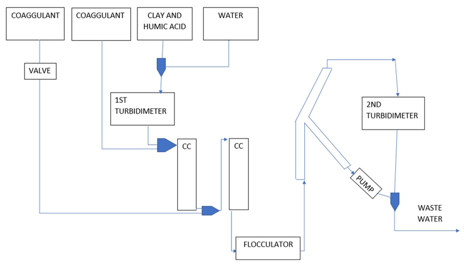

# 2 stage coagulant addition, Spring 2018
#### Barbara Oramah, Ching Pang，Yuhao Du
#### March 1, 2018

<div class="alert alert-block alert-danger">
Why is the title not capitalized?
</div>

<div class="alert alert-block alert-danger">
Please do not delete my comments. Address them in the report and I will check them on the next submission. If you disagree with any of the comments, add your own comment under mine.
</div>

## Abstract
**Previous work:** Last semester, our group designed and fabricated the experiment apparatus and conducted experiment for both 1 stage and 2 stages coagulant addition. Our data is not enough to come up with a grand conclusion, but it suggested that there might be trade-off when we switch from 1 stage to 2 stages. Besides, we also made some simplification to our system.

<div class="alert alert-block alert-danger">
What is the experiment apparatus?

What does 1 stage and 2 stages coagulant addition do and what are their difference?

What were the Conclusions? What are the trade-offs from the switch from 1 stage to 2 stage?

What are simplications?
</div>

**Goals & Objectives:** This semester, our group focused on comparing 1 stage addition with 2 stage addition and carrying on the experiment with different influent turbidities, coagulant dosage, and humic acid concentration as well as trying to improve Yingda's coagulant dosage model. Besides, more insight on the particles bond mechanism, flocculation, and geometry of the contact chambers were needed. Eventually, we will try to close the debate of 1 stage vs 2 stage, come up with a conclusion and generate enough data to support it.

<div class="alert alert-block alert-danger">
Who is Yingda?

What is 1 stage vs. 2 stage addition? What are you adding?
</div>

**What we have accomplished:** Up to now we have completed the literature review, and working on apparatus set up. The research was based on Yingda's thesis, who studied the effect of humic acid on the coagulant dosing model. Based on the bonding mechanism, it could be hypothesized that two-stage coagulant addition would increase the removal efficiency of particles while maintaining the coagulant dosage.

<div class="alert alert-block alert-danger">
this section is much better than the first two = better focus
</div>

**Future work:** We have encountered several problems: the high pressure within the system, the leak caused by the poor connection. In next few weeks, we would fix those problems and begin to conduct our experiment. After discussed with Monroe, we suspected that the size of our first contact chamber is not enough for the HA and coag nanoparticles in the synthetic water to generate enough successful collision, so recalculation and test on the CC are also required.

<div class="alert alert-block alert-danger">
Use full, complete sentences.

The ideas in the final sentece are key to your work this semester and is understandable.

Combine these four sections into one paragraph. An abstract needs to be cohesive and short/clear/concise. Keep it under 100 words. See the abstract description in the rubric.
</div>


## Introduction

The physical and chemical process in flocculation to the optimization of water treatment process, thus a predictive model that can describe the flocculation process is needed. However, in the past research of AguaClara project team, the model we built only consider the clay and coagulant in the system, it is does not replicate the real-life engineering application because NOM can be found in nearly every surface water resources and some of the groundwater resources and the presence of NOM can create a need for increased coagulant doses in drinking water treatment.

<div class="alert alert-block alert-danger">
First sentence is hard to understand.

Define NOM

Key take-aways: traditional models do not include humic acid which is problematic because it is prevalent in water sources.
</div>

So we have to extend the model base on our past research by taking the effect of NOM on flocculation into consideration. After studying the bond mechanism between clay, humic acid, and coagulant, we came up with an assumption that we could add the coagulant separately to save the amount of coagulant, because it was assumed that after stage 1, all coagulant would be coated by humic acid, thus the coagulant adds in stage 2 could merely function as an agglomerant then achieved better performance in flocculation process and the aggregation process. After we have the model, we can try to optimize our water treatment process, for example, using the coagulant more efficiently and cutting down the operational cost. As AguaClara is an engineering project team with limited resources, cost should always be taken into consideration.

<div class="alert alert-block alert-danger">
Good content detailing the importance, but issues with technical writing.

Good connection back to importance on cost and resource availability and description of why 2 stage coagulant addition may work.

The overall description of the project would be confusing to anyone who hasn't heard about it before. Keep in mind your audience is a new member on the team. So think what did you need to know to understand this and then include that info.
</div>

## Literature Review and Previous Work

The fundamental objective of the two stage coagulant addition subteam is to research and find out if there are beneficial effects of two stage addition of PaCl. This would theoretically allow us to use our coagulant more efficiently which would consequently also reduce cost. Besides lab research, this requires research from external parties and other AguaClara teams. We investigated the effects of humic Acid in water and how it coagulates, as well as revisiting Yingda Du’s thesis on the effects of humic acid on flocculation. With this background knowledge, this would aid our advancement in our research.

<div class="alert alert-block alert-danger">
Need to pick first or third person and then stick with it.

What is PACl?

What important information did you get from Yingda's thesis?

This is more of a restatement of the itnroduction. This section should summarize information and background from sources outside and within AguaClara
</div>

Humic acid is considered natural organic matter, and it is of the final components made after the breakdown of plant and animal decay. It is commonly found in the soil as it promotes a fertility, it is also used as fertilizers. There is an increase in humic acid concentrations in the wet seasons. The most visual issue of humic acid is that it cause water to change color. However, in the process of creating potable water, the addition of other compounds and elements with humic acid assists the formation of harmful byproducts such as trihalomethane and haloacetic acid.

<div class="alert alert-block alert-danger">
Consider "Humic acid is a component of natural organic matter" rather than "Humic acid is considered natural organic matter and it is of..."

Why is there an increase in humic acid in the wet seasons?

Do these by-products affect human health or environmental health?

Where are your intext citations?

Do an indepth review and focus on technical writing.
</div>

### Observations and a Geometric Explanation of the Effects of Humic Acid (HA) on Flocculation
  The general science behind flocculation can be understood by analyzing the thesis of the observations and a geometric explanation of the effects of HA flocculation by Yingda Du. The thesis gives a clear layout of why we are using HA as the natural organic matter as well as the chemistry behind the creation of flocs. We are using HA as the exemplary compound to represent dissolved NOM because it is the most commonly found form of NOM in our surroundings. Clay is used to represent the colloidal solids. As NOM is easily found in our soil and water, it increases our need of coagulant to promote flocculation of dissolved particles in water.  Hence why in our model of the experiment we add humic acid and clay with the coagulant PaCl (polyaluminium chloride). However, there is a cut-off point as to how much coagulant we can add to the raw water for it to be beneficial in the removal of NOM. This observation shows that some NOM becomes increasingly uncooperative to being removed due to the increased presence of coagulant. Our understanding of the lack of floc formation in the presence of increased coagulant addition is limited, yet it is an area of interest in determining the magnitude of the effect.

  <div class="alert alert-block alert-danger">
  Repetitive information leads me tobelieve that this report was not checked over before submission.

  How does NOM become increasingly uncooperative to being removed due to increase presence of increased coagulant?

  Is this still from Yinga's thesis? (also refer to them by their last name)

  Explain how there is a lack of floc formation in the presence of increased coagulant addition?
  </div>

Nevertheless, Yingda’s report focuses on the effect on coagulation of humic acid in the form of hydraulic flocculation, with the consideration of the following processes of filtration and sedimentation. Her research is crucial to our subteam as it provides us with a basis of how we should set up our own apparatus, as well as the physics behind the creation of flocs.

<div class="alert alert-block alert-danger">
This paragraph has little content, could it be combined with another section?
</div>

### Using PACl as neutralizer and coagulant aid
Coagulation is one of the most effective methods to remove fine substances from particles. Polyaluminum Chloride (PAC) is often associated with this process to reduce DBPs precursors, which is potentially harmful. PACl prepolymerized coagulants are widely preferred because of its wide range of targets, such as low dosage, wide pH range, low sensitivity of temperature and low residual metal-ion concentration (Sudoh et. al., 2015). The effect of PACl with Calcium Carbonate in removing Humic Acid was significantly efficient comparing to other chemicals, because such combination acts as both alkaline chemical and coagulant agent. Comparing with other coagulant types such as Ferric Acid and Aluminum Sulfate, PACl has a significantly high removal efficiency even at a low dosage. In addition, the removal rate of PACl is higher than that of NaOH as alkaline agent.

<div class="alert alert-block alert-danger">
Isn't coagulation one of the most effective methods to remove fine substances from water?

Consider " Polyaluminum Chloride (PACl) is a coagulant that reduces DBPs..." rather than being associated with Coagulation

What are DBPs?

What capitalize calcium carbonate?

Revise paragraph for singular/plural consistency

This paragraph seems unnecessary as you can just state that PACl is used for it's high removal efficiency and move on.

Focus on the important information to pass along.
</div>

### Effectiveness of Two-Stage Coagulant Addition
Based on Yingda's Thesis, the presence of humic acid as NOM affects the use of PACl as a coagulant for synthetic surface water, but in a one-stage setting, meaning the coagulant is added at once. Last semester, our model considered the attachment efficiency for the hydraulic flocculation. However, past studies have investigated the difference of efficiency of two-stage coagulant addition, meaning adding the coagulants at two different points, comparing with one-stage. (Liu et. al., 2011) Keeping the total amount of coagulant at the same dosage, when partial amount was added half-way, it was found that two-stage can produce floc 1.5 times the floc size comparing with one-stage, which potentially made two-stage more efficient to one-stage. As the floc blanket was formed, the flocs were connected together to for larger adn more irregular structure, making two-stage addition more time-efficient than one-stage.

<div class="alert alert-block alert-danger">
Sometimes you use humic acid and sometimes you use Humic Acid. Be consistent with capitalization (I would say humic acid is more correct)

I don't understand the first sentences

What is attachment efficiency for the hydraulic Flocculation

Where are these results coming from? Source?

Why is two-stage more efficiently

Combine all these above sections into one lit review/previous work without all the separate headers.

This section needs a lot of work for understandability.
</div>

## Methods

### Experimental Design

In our experiment, there should be two contact chambers before the fluid entered the flocculator, they are places for coagulant to collide with particles in the water. Originally, We designed the pump to input the correct coagulant dosage before each contact chamber, allowing the two stage coagulant addition. However, the ProCoDA system we used had its limit, the maximum number of pump it could control was 2, so there had to be one coagulant pump under manual control. So we changed the design, we used the second pump to drain from the first pump when we ran the two stages addition experiment.

<div class="alert alert-block alert-danger">
First sentence is a run-on. Do not include "should" in that sentence because there either are or are not.

I don't fully understand what's going on with the second pump draining from the first pump.

Define ProCoDA
</div>

Finally, we decided to carry out the following procedure. The humic acid would be a fixed variable and the turbidity and the coagulant dosage would vary. Firstly, a set of one stage coagulant addition experiments was carried out while we kept the second coagulant pump closed. The goal of this set of experiment was finding the coagulant dosage which could reduce the effluent turbidity to 3 NTU or less, which was the value that AguaClara filter system requires. After that, the dosage used in that first experiment (1 stage addition) was divided into two parts, where we would find the perfect distribution, at that point most of the coagulant from the first coagulant pump would be used to absorb the humic acid in the system, and coagulant adds by the second pump would only work on lowering the turbidity to be able to attach to every particle in the system to its surface. In order to do this, we installed a T-connection between the two coagulant pumps. This helped us manage the amount of coagulant that was put into the system. The idea behind this was that the first pump would control the total amount of coagulant being put into the system. When the second coagulant pump was open, it would be able to control how much coagulant would be used for the second dosage, drain directly from the first valve, so we could maintain a fixed dosage of the total amount of coagulant put in. This helped us test whether or not having a second dosage of coagulant before the second contact chamber would make the experiment perform better than the total amount of coagulant dosage in one stage.

<div class="alert alert-block alert-danger">
"Finally, we decided to carry out the following procedure" - This sentence is unnecessary, keep focusing on clear and concise writing.

Avoid the words "would", "should", etc. In the words of Yoda "Do or do not, there is no try"

Firstly - why not say "First.."

Watch out for run-on sentences. They make it very hard to read and understand.

I am having a hard time visualizing the T-connection between the coag pumps and the set-up in general. Do you have a photo of the set-up? I am not understanding the rationale about dosaging between the two-stages as described by the latter half of the paragraph.
</div>

### Experimental Apparatus

* Design (calculations, constraints)
The ProCoDA system can only control two pumps, and one of the coagulant pump had to be connected to the system, so we could not add humic acid and clay separately like some of other groups in the lab.

<div class="alert alert-block alert-danger">
Any calculations?

Consider a clearer way to present this information
</div>

* Schematic (label parts)

   Figure： Apparatus Diagram

   <div class="alert alert-block alert-danger">
   Figure number?

   What does CC stand for?
   </div>

The way in which the apparatus worked was the following. To start with, clay, humic acid and water were added according to the calculation, into a 10L stock tank with a stir. This stock tank was connected to the clay pump, the pump speed would be control by ProCoDA system to maintain a relatively fixed influent turbidity. After that, mixture of humic acid and clay went through the first turbidity meter and influent turbidity of the raw water is measured.

<div class="alert alert-block alert-danger">
"The way in which the apparatus worked was the following" is both an incomplete sentence and too fluffy. Instead say how the apparatus worked in that first sentence.

What calculation?

Do you mean stirrer?

How did you determine the pump speed for the fixed turbidity?

What was that turbidity?

Can the results from one experiment with a certain fixed turbidity be generalize for many tubridity levels?

Turbidimeters not turbidity Turbidimeters

Choose between is and was - have to keep tenses consistent.
</div>

Following this, the first dosage of coagulant was added right before the mixture entered the first contact chamber so when it entered the first contact chamber, all of the particles were stuck one with each other.

The second stream of coagulant was pumped into the system after the first contact chamber if we were running a two staged addition experiment.
Initially, we designed a method depending on whether the experiment require the addition of the second coagulant dosage or not, a valve was put so that we could control the coagulant addition. However, it was discovered that better idea to do it in a different way: the valve was taken out and the first coagulant addition pump was connected to the second coagulant addition pump. In this way, if a one addition test was being carried out, the first pump would work providing the previously set coagulant amount. On the other hand, if a two stage test was being carried out, while the first pump was providing the same dosage as before, the second pump would subtract from that the amount required for the second dosage addition.

<div class="alert alert-block alert-danger">
More run-on sentences and incorrect verb usage.

The end of this paragraph is a better description of how the two stage dosing worked.
</div>

Then, the mixture continued on to the second chamber. This can be seen in the following image.

* Image

<div class="alert alert-block alert-danger">
Delete the bullet point for "Image"

Refer to figures by their figure number.
</div>


Figure: Current Apparatus Set-up

<div class="alert alert-block alert-danger">
Figure number? Why don't you include this farther up?
</div>

* Complications in construction
 It is kind of hard to make a perfect system without any leak, because many parts we used in apparatus fabrication is processed by ourself, for example the cut and the drilling, also the "tube stretch". So it required us to keep monitoring the behavior of our apparatus, and fix the problem whenever it occurs.

 <div class="alert alert-block alert-danger">
 Why start bulleted list here?

 What is "tube stretch"
 </div>

* Summary: After the study of last semester and this semester, we came up with this current design. Due to the limit bench area, there is a lot of simplification in our apparatus set-up, but it did reflect the nature of the AguaClara water treatment plant. The next step of our experiment apparatus improvement is to reduce simplification, and recalculation on the size of contact chamber is also required.

<div class="alert alert-block alert-danger">
How will you reduce simplification?

Are the current simplifications justified? Is the data you are getting reliable?
</div>

### Procedure
For one stage addition experiment, in every single circulation, the coag dosage is: 1.1-2.6mg/L, which was increased 7 times using the increment function, in which the values were derived based on those used by Yingda (Author of our reference thesis). We should add two more data point, one between 1-1.5, and the other between 1.5-2.0. Because in the past we generated desirable effluent turbidity around that range, besides, we don't have to start from 0.5mg/L, for that value is too low to treat the raw water.

<div class="alert alert-block alert-danger">
coag is informal, use coagulant Instead

put a space between values and their unit_registry

Do not use colons in the middle of sentences - does not make sense

Why are you redifining who Yingda is again?

Include units on every number

What is the increment function?

Unclear what the last sentence means
</div>

We are planning to run 3 circulations per week, which will take 3 days, and we will use different humic acid between those 3 different trials within a week. Thus we can test the impact of both humic acid and coagulant dosage on the flocculating process.

<div class="alert alert-block alert-danger">
Does each circulation take three days?

What do you mean by "circulation"?

How will this allow you to test the impact of both humic acis and coagulant dosing on flocculating process?
</div>

We will carry on series of control experiment for 2 stages addition, and find the most effective portion of coagulant allocation. Then we will compare with data generated from 1 stage experiment.

<div class="alert alert-block alert-danger">
How do you do the control experiment?

It is unclear to me what past teams have done and what you are doing.
</div>

Two-stage coagulant addition experiment should base on the data we generate with one stage addition experiment, the total amount coag addition can be the least dosage which can achieve the effluent requirement, and then we add two more circulations for comparison, vary the total amount, +-0.5 on the basis of the first trial. During those weeks we conduct two stages addition, we won’t test the effect of humic acid on flocculation because the mechanism of this part should be similar between one and two stage.

<div class="alert alert-block alert-danger">
Run-on sentences make it hard to read. I do not understand this paragraph after reading it twice.
</div>

## Results and Analysis

```python
import numpy as np
import pandas as pd
from matplotlib import pyplot as plt

from aide_design import floc_model as floc

from aide_design.units import unit_registry as u

import sys, os
GitPath = os.path.join('~', 'Documents', 'GitHub')
myGitHubdir=os.path.expanduser(GitPath)
sys.path.append(myGitHubdir)


k = 0.24
coag = np.array([0.53, 1.06, 1.59, 2.11, 2.56]) * u.mg/u.L
conc_humic_acid = np.array([0, 3, 6, 9, 12, 15] * u.mg/u.L)
# dataset[0] is the 50NTU, dataset[1] is the 100NTU.
# Within both subgroups, [0] is the pC.0, ranging evenly up to [5] which is the
# pC.15
dataset = np.array([[  # Dataset[0]: the 50NTU datasets
                     [0.634, 0.729, 0.891, 1.062, 1.205],
                     [0.563, 0.717, 0.903, 1.038, 1.193],
                     [0.136, 0.513, 0.793, 1.027, 1.095],
                     [0.109, 0.264, 0.749, 1.002, 1.089],
                     [0.084, 0.128, 0.647, 0.962, 1.057],
                     [0.061, 0.094, 0.308, 0.717, 0.928]
                     ],
                    [  # Dataset[1]: the 100NTU datasets
                     [0.746, 0.953, 1.191, 1.295, 1.414],
                     [0.563, 0.835, 1.085, 1.255, 1.403],
                     [0.185, 0.692, 0.971, 1.254, 1.390],
                     [0.105, 0.280, 0.956, 1.238, 1.361],
                     [0.097, 0.207, 0.740, 1.209, 1.316],
                     [0.084, 0.157, 0.566, 1.084, 1.314]
                     ]
                    ])
indexnames = ['{0} mg/L'.format(i) for i in np.arange(0,16,3)]
Data50NTU = pd.DataFrame(dataset[0], index=indexnames).T

Data100NTU = pd.DataFrame(dataset[1], index=indexnames).T
print(Data50NTU)

coagGraph = np.arange(1 * 10**-4, 25.1 * 10**-4, 1 * 10**-4) * u.kg/u.m**3
enerDis = 4.833 * u.mW/u.kg
temperature = 25 * u.degC
resTime = 302 * u.s
tubeDiam = 3/8 * u.inch
# Begin graphing the 50NTU datasets
plt.figure('50NTU', (6,6))
plt.title('50 NTU Graph')
plt.ylabel('pC*')
plt.xlabel('coagulant dosage (mg/L)')


plt.plot(coag, Data50NTU['0 mg/L'], 'r.', coag, Data50NTU['3 mg/L'], 'b.',
         coag, Data50NTU['6 mg/L'], 'g.', coag, Data50NTU['9 mg/L'], 'm.',
         coag, Data50NTU['12 mg/L'], 'c.', coag, Data50NTU['15 mg/L'], 'y.')

 plt.show()
 ```


 

                        Figure: model result which guide our experiment

 

                        Figure: one of the typical experiment we ran
<div class="alert alert-block alert-danger">
What is going on with these datalogs and the code? Is that a remnant of the template? It is unprofessional looking.
</div>

In this plot
After describing a particular result, within a paragraph, go on to connect your work to fundamental physics/chemistry/statics/fluid mechanics, or whatever field is appropriate. Analyze your results and compare with theoretical expectations; or, if you have not yet done the experiments, describe your expectations based on established knowledge. Include implications of your results. How will your results influence the design of AguaClara plants? If possible provide clear recommendations for design changes that should be adopted. Show your experimental data in a professional way using the following guidelines:

* **Did these results line up with expectations?**
In this semster, up to now, we only did several trials of one stage addition. Our expectation for the one stage addtion is that the floc blanket can be found in our sedimentation tank and the effluent go down to a level that is desirable for the AguaClara filtration system. The effluent turbidity in several trials happened to be around 20NTU, we assumed that it was due to the limit time of our data acquisition state, namely, we did not give the system enough time to form the floc blanket, so we extend the duration of that state, from 3600 seconds to 4800.

<div class="alert alert-block alert-danger">
Why is this formatted in a bulleted list with questions? It should be written in formal paragraphs as a normal research report would contain.

What are thefull results of your several trials completed of one stage addition? Are there any graphs? Any preliminary findings?

What does the duration change?
</div>

* **What went wrong?**
As we can see, the effluent turbidiy did not vary a lot even though the increment function worked, after examining the data we found that the coagulant pump actually worked around its lowest speed, and the past research showed that our pump did not work well at that speed. Therefore, for future experiments, we are going to set a higher intercept for the increment function, so the lowest rpm in our experiment now is 12.

<div class="alert alert-block alert-danger">
I get that pump speed is an issue here but I don't know why. What determined the rpms of your pumps? Why is 20 NTU a bad result?

This sections needs much more development and polishing.
</div>

## Conclusions

At this point, we fully understood the ProCoDA system and could use the increment function to carry on set of control experiments with fixed turbidity and different coagulant dosage. Also we had implemented an electronic balance which also connects to the ProCoDA system to track the mass change of coagulant over time. It could offer us data to confirm our ProCoDA code will guide the pump to add coagulant to the amount we calculate.

Generally, we deduced that by using the current design of system, when the turbidity is relatively low, we will need more coagulant to reach the target effluent turbidity.In this experiment, our target effluent turbidity should be no more than 3 NTU, which is already expected with the standard Aguaclara system.

The calculation of coagulant dosage and the component of clay-humic acid mixture could be done on python now, we transfered the original MathCAD base code and translated it into python.

In the rest semester, we would keep running both one stage and two stage experiment.

If we validate our 2 stage hypothesis, we could use this model to guide the dosage in water treatment plant and save the coagulant, cut down the operational cost.

<div class="alert alert-block alert-danger">
This section should be more tailored to your research question and not what you have learned about the set-up and other constraints.

The conslusion in the second paragraph is not supported adequately in your report.
</div>

## Future Work
We have encountered several problems: the high pressure within the system, the leak caused by the poor connection. In next few weeks, we would fix those problems and begin to conduct our experiment. After discussed with Monroe, we suspected that the size of our first contact chamber is not enough for the HA and coag nanoparticles in the synthetic water to generate enough successful collision, so recalculation and test on the CC are also required.

<div class="alert alert-block alert-danger">
Section has sentences that are incomplete.

The size o the contact chamber is not discussed in report. There should be no new info in the conslusion and future work sections.

How do you design the contact chambers?
</div>

## Bibliography
Logan, B. E., Hermanowicz, S. W., & Parker,A. S. (1987). A Fundamental Model for Trickling Filter Process Design. Journal (Water Pollution Control Federation), 59(12), 1029–1042.

<div class="alert alert-block alert-danger">
What/Where are your sources? (including Yingda's thesis)
</div>

## Fabrication Details
Include any information related to the fabrication of equipment, experimental apparatuses, or technologies. Include the purpose of each step and the fabrication methods used. Reference appropriate safety precautions.


## Experimental Methods
### Set-up
***attention：*** the content about experiment set-up is distributed to the fabriaction and experiment part.

<div class="alert alert-block alert-danger">
I don't understand the point of the attention section.
</div>

### Experiment
**Step 1.** Make sure the stocks are filled. One stock will have a diluted solution of coagulant and the other will have a solution of water, clay, and humic acid. The concentration depends on the experiment you want to run.


**Step 2.** Once the stocks are ready, the water and wastewater valves are open, the turbidimeters open, and the apparatus completely filled with water, the experiment is now ready to run.

**Step 3.** Be sure to turn on the wastewater pump, next to the effluent turbidimeter, to ensure that the flocs in the weir are transported to the wastewater line. We do not want the flocs to go through the effluent turbidimeter.


**Step 4.** Go to ProCoDa and turn the state from OFF to ON to begin the clay pump so the influent turbidimeter will reach 100 NTU. Once the turbidimeter is steadily at 100 NTU, go back to ProCoDa and turn the stage from ON to Data acquisition state, which will turn on the coagulant pump.
**Step 5.** The Data Acquisition state will go back and forth with the Flush state which is used for second stage addition. The data will be recorded on an excel file to be analyzed later.
**Step 6.** Once the experiment was ran and the data collected, turn off ProCoDa and save the data. Proceed to the cleaning procedure when experimentation is finished.

<div class="alert alert-block alert-danger">
Check formatting and the technical writing.

Where can I get info on making clay stocks?
</div>

### Cleaning Procedure
 Once the experiment is done, we want to completely wash out the apparatus so it will be ready for the next experiment.
 **Step 1.** Turn off the clay and coagulant pump while let the tap water pump run at a relative high speed.

**Step 2.** Remove entire apparatus from wall (recirculator \& tube settler) and throughly wash it out, then reattach it back to the wall

**Step 3.** Wash out the Flocculator by unplugging the connection between the the outflow tube from the influent turbidimeter and the flocculator, and plug in tubing from the nearby sink to wash out the flocculator. Make sure there is a bucket at the end of the flocculator that will collect the water.

**Step 4.** Clean the influent and effluent turbidimeter. Make sure to turn on the Bypass channel first! First, open the bypass valve. Second, pinch the black outflow tube. Third, close the inflow valve.

**Step 5.** Remove and wash out the vials from both turbidimeters. Refill the vials with clean water, then put back into the turbidimeters.Use Kim wipes to clean the glass throughly.

<div class="alert alert-block alert-danger">
Do you mean kimtech wipes?
</div>

**Step 6.** Turn off water to the flocculator and detach the tubing. Hook up the influent turbidimeter back into flocculator then re-open the influent turbidimeter BUT keep the effluent turbidity meter closed. Turn on the water pump to clean out the influent turbidimeter as well as the flocculator.

**Step 7.** Pour out the coagulant reservoir into a different bucket and rinse reservoir with deionized water to make sure all residue is washed out. Take out the push pin then wash out the coagulant reservoir throughly. Replenish reservoir with 5L (or less) of deionized water. Use MathCAD to determine how much 70.9mg/L PAC coagulant needed to use to get the desired results for the experiment.

<div class="alert alert-block alert-danger">
Where can I find info on how to set-up the apparatus?
</div>

## Experimental Checklist
Before running the experiment, we check apparatus following steps below:

First, we open the influent and effluent turbidity meter and check whether the inside glass container is clean;

Second, before reassemble the turbidity meter again, we turn on only the water pump and let tap water run through the system to see if their is any leak in the system, especially near the turbidity meter, in case water would flow to interior of the meter and cause damage to the apparatus;

Third,  turn on all pumps and set them with a tiny RPM value, then check if pumps run in the right direction;

Fourth, go to the "edit rules" part of the ProCoDA, check the parameter of increment function, make sure those valve are set according to the calculation;

Fifth, and the last step, go the the "operation" part of ProCoDA, start the system with "Data Acquisition States" and make sure states would switch between one another automatically.

<div class="alert alert-block alert-danger">
Keep list formatting consistent with sections above.

Good checklist
</div>

## ProCoDA Method File
Use this section to explain your method file. This could be broken up into several components as shown below:

### States

***I don't know why the template kept the format of Overleaf***

<div class="alert alert-block alert-danger">
What do you mean by this? Why did you not ask this question to someone before submission?
</div>

**{OFF}** - Resting state of ProCoDA. All sensors, relays, and pumps are turned off.

**{ON}** - ON state of ProCoDa. All sensors, relays, and pumps are turned on.

**{Data Acquisition}** - State 3 of the experimental process where the coagulant pump is working and the increment function would increase its value each time when we switch to this state. The data acquisition state usually set to be 2 hours, which is enough for the floc blanket to form.

**{Flush}** - State 4 of the experimental process where the coagulant pump stop working, during this stage raw water would run through the system and flush out the floc blanket build in last data acquisition state, so that every data acquisition state would run with same original system condition.


### Set Points

**{Turb target}** - This set point has the same value as our target influent turbidity, and would control the clay pump.

**{pump control(clay)}** - use this to decide which pump should we control.

**{Flush Time}** - Duration of the flush state.

**{Data Acquisition Time}** - Duration of the data acquisition state.

**{State to Increment}** - Tell the increment function when to increase its value, in this experiment, we use increment function to control coagulant pump speed.

**{Slope}** - The slope of increment function.

**{Intercept}** - The intercept of increment function.

**{Max x}** - How many time would the increment function work during one circulation.

**{coag pump control}** - use this to decide which coagulant pump should we control.

**{coag pump property}** - Flow rate per revolution.

**{balance}** - Variable with value returned by the electrical balance.


 ## Python Code

 ### Variables
 $g$: gravity
 $\sigma$: dispersion
 $a$: amplitude
 $h$: water depth
 $H$: distance from wave crest to trough (2$a$)
 $T$: wave period
 $\lambda$: wavelength
 $k$: wavenumber
 $c_p$: celerity (wave phase speed)
 $P$: pressure
 $F$: force
 $u$, $w$: x-velocity, z-velocity components

 ```python
 # flow rate of the system
 V_sedimentation = 2*(u.mm/u.s)
 # i did not have the ID data of the 1 inch PVC pipe
 ID_pipe = 0.96*u.inch
 Area_pipe = 0.25*np.pi*(ID_pipe**2)
 Q_system = V_sedimentation*Area_pipe
 # output the value

 # QUES: what is the relation of inlet water pump RPM w/ this value???

 print('The flow rate of the system is', (ut.sig(Q_system.to(u.mL/u.s),3)))
 # mass flow of coagulant

 # desired conc of PAC per L of water in the system. (0.5-2.5mg/L)(normally fixed range)

 conc_PACL = 1.1*(u.mg/u.L)
 # conc_PACL = np.array[(0.0,0.5,1.0,1.5)]
 MassFlow_coag = conc_PACL*Q_system
 print('The mass flow of coagulant in the system is',ut.sig(MassFlow_coag.to(u.mg/u.s),3))
 # how many mL of lab concentration are added per L into the reservoir(adjustable)
 k_dilution = 3.13*(u.ml/u.l)

 # concentration in grams per L of lab solution(normally fixed value)
 conc_labsolution = 70.9*(u.g/u.L)

 conc_reservoir = conc_labsolution*k_dilution
 Q_reservoir = MassFlow_coag/conc_reservoir
 print('The volumetric flow rate of solution leaving the reservior \
 and entering the system to achieve desired final concentration',Q_reservoir.to(u.mL/u.s))

 V_reservoir = 1*u.L
 V_lab_solution = V_reservoir*conc_reservoir/conc_labsolution
 print('The volume of lab concentration solution we need to add into the reservoir is',ut.sig(V_lab_solution,3))
 # The flow pumped out of the pump per round(measured by experiment)
 Q_perRPM_coag1 = 0.00042*(u.ml/u.s)
 # Q_perRPM_coag2 = 0.0025*(u.ml/u.s)
 numRPM = Q_reservoir/Q_perRPM_coag1
 print('The pump should run with a speed of',numRPM.to(u.dimensionless))
 ```

<div class="alert alert-block alert-danger">
Where is the coagulant concentration coming from?

What is k_dilution?

Need better commenting

Is this all of the code necessary?
</div>

```python
# To convert the document from markdown to pdf
pandoc Name_of_this_file.md -o TeamName_Research_Report.pdf
```
